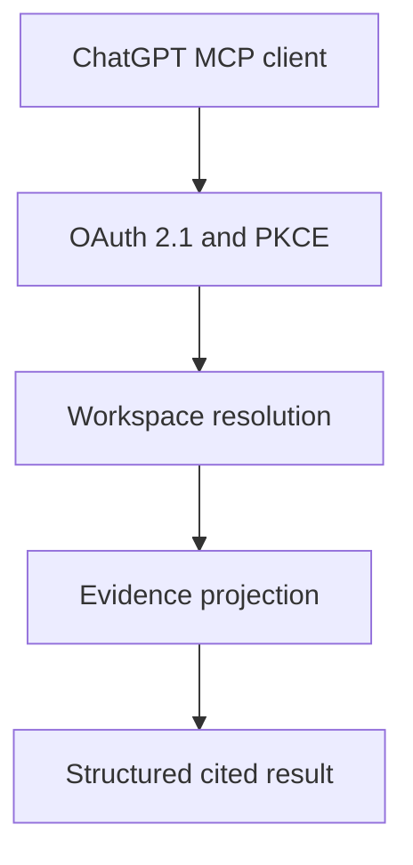

# ChatGPT MCP Architecture

## Boundary

The Express API owns authentication, workspace membership, tenant resolution,
and evidence retrieval. ChatGPT receives a read-only view of stored product
evidence through MCP and does not become the source of record.

Each POST creates a fresh MCP server and transport. The authenticated principal
is captured in the server instance, so tool inputs cannot replace identity.
Every workspace-scoped operation resolves membership before accessing tenant
data.

## Data Flow

The evidence projection uses existing dataset, scored-record, and
decision-brief services. It adds no second database and does not recalculate an
engine result. Stored normalized values, legacy fixed-rule heuristics,
versioned intelligence, citations, and unknowns remain distinct.

## Failure Behavior

- missing or invalid authentication stops before MCP tool execution;
- denied workspace membership stops before tenant data access;
- invalid ids and input bounds return safe tool errors;
- unexpected exceptions are reduced to a generic tool failure;
- an absent or failed engine result remains explicit;
- no stale or synthetic intelligence is substituted.

## Scaling Direction

The current candidate list reads the authorized dataset score collection and
then applies bounded response pagination. Before large production datasets,
storage-level cursor pagination should replace this in-memory slice. This is a
known performance improvement, not a correctness gap in the returned page.

The stateless MCP server avoids cross-user session memory. OAuth grants and
revocation state persist in MongoDB so token integrity does not depend on one
process. The current fixed-window limiter is process-local; a multi-instance
deployment needs an ingress or shared limiter.

OAuth is implemented and covered by repository tests. Public operation still
needs stable HTTPS deployment, ingress validation, payload-safe observability,
load tests, tenant-role testing from ChatGPT, and rollback evidence. See the
[OAuth threat model](chatgpt-oauth-threat-model.md).
