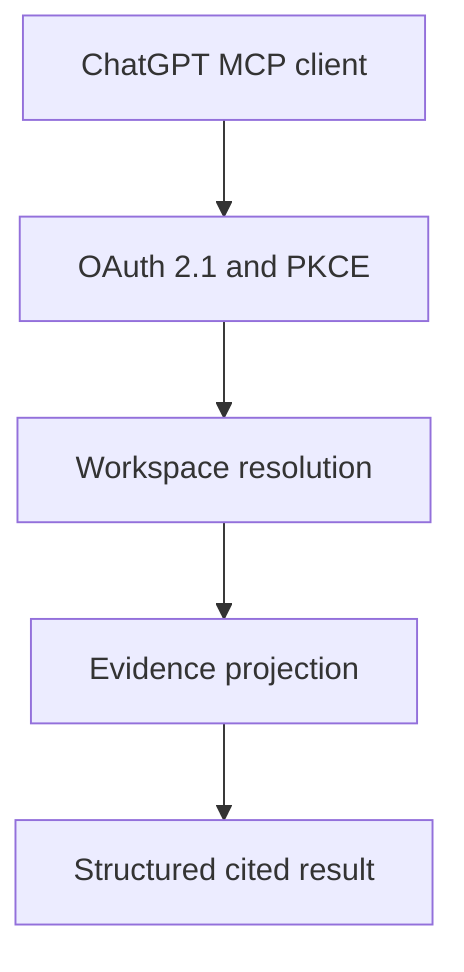

# ChatGPT MCP Architecture

## Boundary

The Express API owns authentication, workspace membership, tenant resolution,
and evidence retrieval. ChatGPT receives a read-only view of stored product
evidence through MCP and does not become the source of record.

Each POST creates a fresh MCP server and transport. Protocol initialization and
tool discovery may create an unprivileged server instance so a compatible
client can learn the OAuth policy. A verified principal is captured in the
server instance before a tool can access data, so tool inputs cannot replace
identity. Every workspace-scoped operation resolves membership before
accessing tenant data.

## Data Flow

The evidence projection uses existing dataset, scored-record, and
decision-brief services. It adds no second database and does not recalculate an
engine result. Stored normalized values, legacy fixed-rule heuristics,
versioned intelligence, citations, and unknowns remain distinct.

## Failure Behavior

- missing authentication permits only protocol/tool discovery; tool calls
  return a safe OAuth challenge before any data service runs;
- invalid, expired, or revoked presented credentials stop at the HTTP boundary;
- denied workspace membership stops before tenant data access;
- invalid ids and input bounds return safe tool errors;
- unexpected exceptions are reduced to a generic tool failure;
- an absent or failed engine result remains explicit;
- no stale or synthetic intelligence is substituted.

## Scaling Direction

The current candidate list reads the authorized dataset score collection and
then applies bounded response pagination. Before large production datasets,
storage-level cursor pagination should replace this in-memory slice. This is a
known performance improvement, not a correctness gap in the returned page.

The stateless MCP server avoids cross-user session memory. OAuth grants and
revocation state persist in MongoDB so token integrity does not depend on one
process. Private staging is configured as one container instance behind two
Cloudflare rate-limit bindings plus the process-local OAuth limiter. The edge
bindings are per Cloudflare location and not an exact global counter; a
multi-instance release still needs a verified shared application limiter.

The private-staging gateway exposes only health/readiness, OAuth discovery and
lifecycle, and `/mcp`. Payload-safe operational telemetry records bounded route
metadata and never records prompts, tool arguments, bearer credentials, query
strings, emails, rows, or evidence bodies. See the
[private-staging topology](chatgpt-private-staging-topology.md).

OAuth and the private-staging service are implemented and covered by repository
and deployment verification. Stable HTTPS, load/rate-limit checks,
authenticated tenant-role tests, payload redaction, and rollback/recovery have
live receipts. A real ChatGPT owner connection, approved data, connected
prompt-injection evaluation, and pilot evidence remain separate gates. See the
[OAuth threat model](chatgpt-oauth-threat-model.md).
